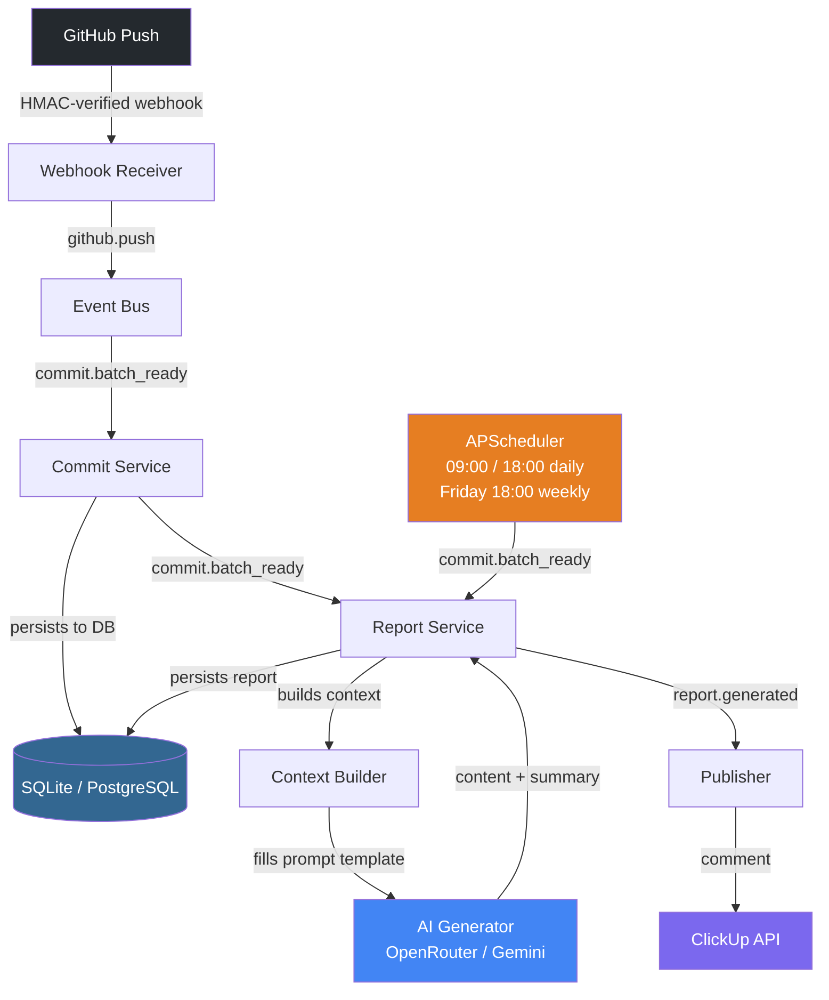

# ArkLog

> **AI-powered progress reporter.** Turns GitHub commits into intelligent reports — automatically posted to your project management platform.

[](https://www.python.org/)
[](https://fastapi.tiangolo.com/)
[](LICENSE)
[](https://github.com/astral-sh/ruff)

---

## What is ArkLog?

ArkLog listens to your GitHub repositories via webhooks. Every push triggers an AI analysis of the commits — what changed, why it matters, and what phase the project is in. The result is posted as a structured comment in your task management platform.

No dashboards to check. No manual updates. Your tasks stay informed automatically.

---

## Architecture



**Event topology:**

| Event | Producer | Consumer |
|---|---|---|
| `github.push` | Webhook receiver | Commit Service |
| `commit.batch_ready` | Commit Service · Scheduler | Report Service |
| `report.generated` | Report Service | Publisher |

---

## Quick Start

### 1. Clone and install

```bash
git clone https://github.com/alvaro-alencar/ArkLog.git
cd ArkLog
python -m venv .venv
source .venv/bin/activate  # Windows: .venv\Scripts\activate
pip install -e ".[dev]"
```

### 2. Configure environment

```bash
cp .env.example .env
# Edit .env with your keys
```

Required variables:

| Variable | Description |
|---|---|
| `GITHUB_WEBHOOK_SECRET` | HMAC secret — must match GitHub webhook config |
| `GITHUB_TOKEN` | Personal Access Token (private repos + backfill) |
| `AI_API_KEY` | OpenRouter API key |
| `AI_MODEL` | Model ID (default: `google/gemini-2.5-flash`) |
| `CLICKUP_API_TOKEN` | ClickUp personal token |
| `CLICKUP_TEAM_ID` | Your ClickUp workspace ID |
| `DATABASE_URL` | SQLite (default) or PostgreSQL |

### 3. Configure projects

```bash
cp projects.yaml.example projects.yaml
# Edit projects.yaml
```

### 4. Run migrations and start

```bash
alembic upgrade head
uvicorn app.main:app --reload
```

### 5. Configure GitHub webhook

In each repository: **Settings → Webhooks → Add webhook**

- **URL:** `https://your-domain/api/v1/webhooks/github`
- **Content type:** `application/json`
- **Secret:** value of `GITHUB_WEBHOOK_SECRET`
- **Events:** Just the push event

---

## projects.yaml

```yaml
projects:
  - name: "My Project"
    repo_owner: "github-user"
    repo_name: "repo-name"
    description: "What this project does."
    report_style: "misto"          # executivo | tecnico | misto
    tech_stack: [Python, FastAPI]
    business_context: "Context for the AI — current phase, stakeholders, constraints."

    reports:
      # Triggers on every push AND at scheduled times
      - label: "daily"
        clickup_task_id: "abc123"
        schedule: daily
        times: ["09:00", "18:00"]
        report_style: misto

      # Full-week report every Friday — review before sending to stakeholders
      - label: "weekly"
        clickup_task_id: "abc123"
        schedule: weekly
        day: friday
        time: "18:00"
        report_style: misto
```

| `report_style` | Audience |
|---|---|
| `executivo` | Stakeholders — business language, no jargon |
| `tecnico` | Engineers — file/module references, architectural decisions |
| `misto` | Both sections combined |

---

## API Reference

| Method | Endpoint | Description |
|---|---|---|
| `GET` | `/api/v1/projects` | List all projects with DB stats |
| `GET` | `/api/v1/projects/{name}/timeline?days=30` | Daily activity timeline |
| `POST` | `/api/v1/projects/{name}/backfill` | Fetch full history + generate historical report |
| `GET` | `/api/v1/reports/{id}` | Fetch a specific report |
| `GET` | `/api/v1/analytics/health` | Health scores per project |
| `POST` | `/api/v1/webhooks/github` | GitHub webhook receiver |

---

## Scheduler Behavior

ArkLog generates two report types per project, both maintaining **continuity** — each report starts exactly where the previous one ended, with no gaps or duplicate commits.

**Daily** (`daily_scheduled`):
- Has commits → AI analyzes what changed
- No commits + clear context → AI infers current phase ("awaiting App Store review", "in stabilization")
- No commits + no context → "project in planning and task definition phase"

**Weekly** (`weekly_scheduled`) — every Friday 18:00:
- Covers all commits since the last weekly report
- Extended prompt (400 words) for a thorough review
- Designed to be read, verified, and forwarded to stakeholders manually

---

## Backfill

Generate a comprehensive first report covering an entire project's history:

```bash
curl -X POST http://localhost:8000/api/v1/projects/MyProject/backfill
```

Fetches all commits from the GitHub API, persists them, and generates a detailed historical analysis with up to 8,000 tokens of AI output.

---

## Supported Platforms

| Platform | Status |
|---|---|
| ClickUp | ✅ Supported |
| Slack | 🔜 Planned |
| Notion | 🔜 Planned |
| Linear | 🔜 Planned |
| Discord | 🔜 Planned |
| GitHub Issues | 🔜 Planned |

> **Want to add a platform?** Implement `BasePublisher` — see [`app/integrations/README.md`](app/integrations/README.md).

---

## Project Structure

```
ArkLog/
├── app/
│   ├── ai/              # AI engine: context builder, prompt renderer, generator
│   ├── api/             # FastAPI routers and HTTP endpoints
│   ├── config/          # projects.yaml loader with Pydantic validation
│   ├── core/            # Settings, event bus, application lifecycle
│   ├── domain/          # Pure domain entities (no framework dependencies)
│   ├── integrations/    # External platform adapters (GitHub, ClickUp, ...)
│   ├── models/          # SQLAlchemy ORM definitions
│   ├── repositories/    # Data access layer (Repository pattern)
│   ├── schedulers/      # APScheduler job registration
│   ├── schemas/         # Pydantic API request/response models
│   ├── services/        # Business logic and event orchestration
│   └── utils/           # Shared utilities
├── alembic/             # Database migrations
├── prompts/             # AI prompt templates (plain Markdown)
├── tests/               # Test suite
├── projects.yaml        # Your project configuration (gitignored)
└── .env                 # Secrets (gitignored)
```

---

## Contributing

ArkLog is open source and welcomes contributions. The highest-impact areas:

- **New publisher integrations** — implement `BasePublisher` and add your platform ([guide](app/integrations/README.md))
- **New AI providers** — the client is OpenAI API-compatible; OpenRouter alone gives you 100+ models
- **Prompt improvements** — templates are plain Markdown files in `prompts/`

See [`CONTRIBUTING.md`](CONTRIBUTING.md) for setup, conventions, and PR process.

---

## License

MIT — see [LICENSE](LICENSE).
